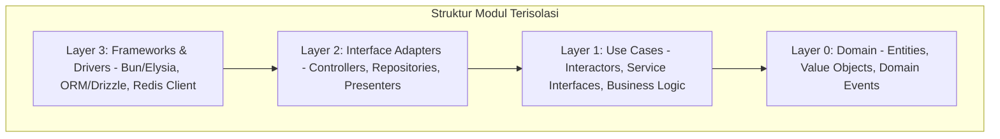
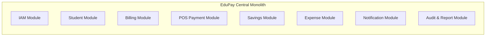
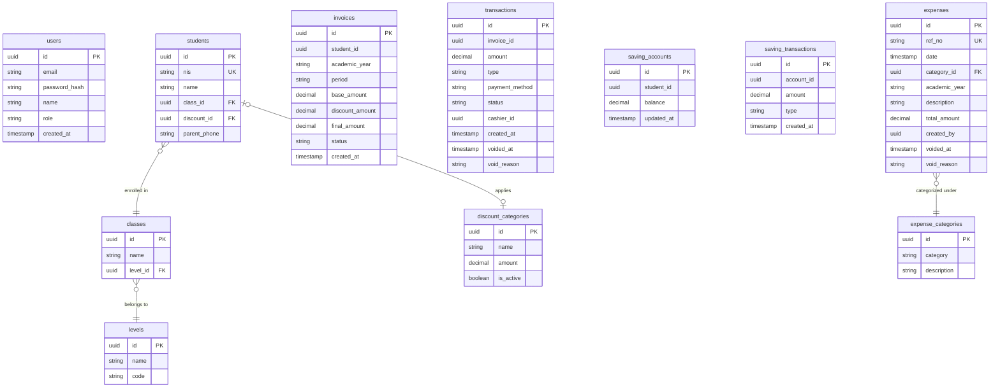
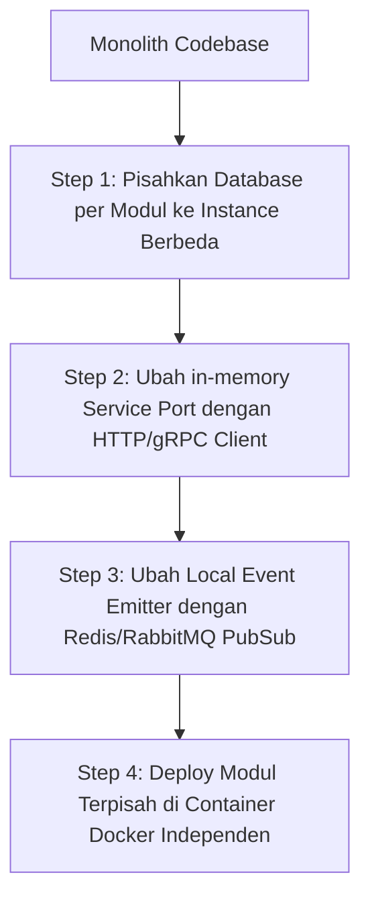

# 📘 Product Requirement Document (PRD): Aplikasi Bayaran Madrasah
## Sistem Manajemen Keuangan Sekolah Madrasah Terpadu

**Document Owner:** Development Team / Antigravity AI  
**Status:** Draft / Review Ready  
**Tech Stack:** Bun Runtime, PostgreSQL, Redis, Clean Architecture, Modular Monolith (Microservice Compatible)

---

## 1. Executive Summary

Aplikasi Bayaran Madrasah adalah platform Enterprise Resource Planning (ERP) khusus pengelolaan keuangan sekolah (Yayasan) yang mengintegrasikan unit-unit sekolah seperti MI, MTs, dan MA. Aplikasi ini dirancang untuk memecahkan masalah rekonsiliasi kas lambat, hilangnya jejak audit transaksi, manajemen tagihan massal yang rumit, serta fleksibilitas pembayaran siswa.

Dokumen ini mendefinisikan arsitektur backend baru berbasis **Bun Runtime** dengan pendekatan **Modular Monolith** yang menerapkan prinsip **Clean Architecture** dan **Clean Code**. Sistem ini dirancang agar sangat modular, sehingga setiap modul dapat dengan mudah dipecah menjadi **Microservice** mandiri di masa mendatang tanpa perlu melakukan penulisan ulang kode secara masif.

---

## 2. Peta Arsitektur & Prinsip Desain

Sistem backend didesain menggunakan pola **Modular Monolith**. Seluruh modul berjalan dalam satu proses (deployment tunggal menggunakan Bun), namun dipisahkan secara ketat di tingkat kode dan database.

### 2.1 Clean Architecture Layers per Modul

Setiap modul di dalam sistem akan menerapkan 4 layer Clean Architecture yang terisolasi:



1. **Domain Layer (Core)**:
   - Berisi entity bisnis, value objects, dan aturan validasi dasar.
   - **Aturan**: Bebas dari dependensi library eksternal (termasuk framework HTTP atau ORM). Hanya pure TypeScript.
2. **Use Case Layer (Business Logic)**:
   - Berisi alur kerja aplikasi (interactors). Menentukan apa yang harus dilakukan aplikasi saat menerima input.
   - Mendefinisikan *interface* (port) untuk database repository dan service eksternal.
   - **Aturan**: Hanya boleh mengimpor dari Domain Layer. Tidak boleh tahu tentang database konkret atau router HTTP.
3. **Interface Adapters Layer**:
   - Menghubungkan use case dengan dunia luar. Berisi implementasi dari repository interface (misalnya menggunakan Drizzle ORM atau Prisma) dan controller (request parser & formatter).
   - **Aturan**: Mengubah data dari format eksternal ke format internal yang dipahami Use Case.
4. **Frameworks & Drivers Layer**:
   - Bagian paling luar yang berisi server HTTP (Elysia.js/Bun.serve), driver database, logger, dan tools pihak ketiga.

---

### 2.2 Aturan Kompatibilitas Microservices (Decoupling Rules)

Untuk menjamin modul dapat dipisah menjadi microservice secara instan di kemudian hari, aturan berikut **wajib** dipatuhi:

1. **Database Isolation (No Cross-Module Joins)**:
   - Setiap modul secara logis memiliki tabelnya sendiri. 
   - Modul **dilarang keras** melakukan SQL `JOIN` ke tabel milik modul lain.
   - Jika `Module Billing` membutuhkan data nama siswa dari `Module Student`, `Module Billing` harus memanggil interface `StudentServicePort` yang disediakan oleh `Module Student` (tidak langsung query tabel `students`).
2. **Interface-Based Communication**:
   - Komunikasi antar-modul di tingkat kode hanya boleh melalui *Interface* / *Service Ports* yang terdefinisi dengan jelas.
   - Pada fase Monolith, implementasi port ini berupa pemanggilan fungsi in-memory (di dalam RAM). Saat bermigrasi ke Microservices, kita cukup mengganti implementasi port tersebut dengan HTTP client, gRPC, atau message broker client tanpa mengubah Use Case di kedua modul.
3. **Event-Driven Asynchronous Communication**:
   - Proses yang tidak memerlukan konsistensi instan (misalnya: mengirim WhatsApp setelah sukses bayar, mencatat log audit, memperbarui status tabungan) harus menggunakan **Domain Event**.
   - Gunakan internal event emitter (misal: `EventEmitter2` atau Bun event handler) di dalam monolith. Event ini nantinya dapat langsung dipetakan ke Redis Pub/Sub, RabbitMQ, atau Kafka saat beralih ke arsitektur microservices.
4. **Shared-Nothing Schema**:
   - Setiap modul mendefinisikan skema databasenya sendiri. Skema database didefinisikan per folder modul (misalnya `src/modules/billing/db/schema.ts`).

---

### 2.3 Prinsip Clean Code yang Diterapkan

- **SOLID Principles**: Single Responsibility (kelas/fungsi hanya melakukan satu hal), Open/Closed (terbuka untuk ekstensi, tertutup untuk modifikasi).
- **Self-Documenting Code**: Nama fungsi dan variabel harus deskriptif (misal: `calculateFinalInvoiceAmountAfterDiscount` daripada `calcAmt`).
- **Comprehensive Error Handling**: Menggunakan pola *Result Object* (`{ success: boolean, data?: T, error?: ApplicationError }`) untuk menghindari `throw error` yang tidak terkontrol di luar boundary use case.
- **Fail-Fast & Validation**: Validasi input di boundary terluar (Layer Controller) menggunakan schema validator Bun (TypeBox / Zod) sebelum data masuk ke use case.

---

## 3. Spesifikasi Tech Stack

| Teknologi | Pilihan Utama | Alasan Pemilihan |
| :--- | :--- | :--- |
| **Runtime Engine** | **Bun (v1.1+)** | Runtime JavaScript/TypeScript super cepat dengan bundler, test runner, dan package manager bawaan yang menghemat resource sistem. |
| **Backend Framework** | **Elysia.js** | Framework web ultra-cepat yang didesain khusus untuk Bun, memiliki integrasi schema validator bawaan (TypeBox) yang menjamin type-safety dari route hingga client. |
| **ORM** | **Drizzle ORM** | ORM berbasis TypeScript dengan performa mendekati raw SQL, mendukung pemisahan skema per modul secara rapi dan migrasi database yang cepat. |
| **Database** | **PostgreSQL (v16+)** | Database relasional untuk menjamin konsistensi data transaksi finansial (ACID). |
| **Cache & Message Broker** | **Redis** | Digunakan untuk session caching dan task queueing untuk pengiriman WhatsApp. |
| **Testing Framework** | **Bun Test** | Test runner bawaan Bun yang sangat cepat untuk menjalankan Unit Test & Integration Test. |

---

## 4. Definisi Modul Bisnis (Domain Bounded Contexts)

Aplikasi dibagi menjadi 8 modul fungsional:



---

### 4.1 Modul 1: Identity & Access Management (IAM)
Mengelola autentikasi pengguna, token JWT, dan Role-Based Access Control (RBAC).

*   **Entitas Utama**: `User`, `Role`, `Session`
*   **Peran Pengguna (RBAC)**:
    *   **SUPERADMIN**: Akses penuh ke seluruh sistem, manajemen pengguna, konfigurasi global.
    *   **ADMIN_TU**: Operasional kasir (POS), input diskon, kelola tabungan, input pengeluaran.
    *   **KEPALA_SEKOLAH**: View-only dashboard & laporan sesuai tingkatan yang dipimpin (MI/MTs/MA). Menerima notifikasi Void.
    *   **YAYASAN**: View-only dashboard global, menerima notifikasi Void.
*   **Keamanan**:
    *   JWT berumur pendek (Short-lived Access Token) + Refresh Token disimpan di HttpOnly Cookie.
    *   Password di-hash menggunakan algoritma bawaan Bun (`Bun.password.hash` dengan bcrypt/argon2).

---

### 4.2 Modul 2: Academic & Student Master Data
Mengelola informasi akademis dasar seperti tahun ajaran, tingkat sekolah, kelas, data siswa, dan kategori diskon tetap.

*   **Entitas Utama**: `AcademicYear`, `Level` (MI, MTs, MA), `Class`, `Student`, `DiscountCategory`
*   **Fitur Utama**:
    *   **Import Siswa**: Unggah massal data siswa menggunakan parser file Excel (xlsx) dengan validasi format NIS yang ketat.
    *   **Kenaikan Kelas Massal**: Promosi kelompok siswa dari kelas lama ke kelas baru berdasarkan tingkatan akademik.
    *   **Kategori Diskon**: Konfigurasi diskon nominal atau persentase (contoh: Anak Yatim, Anak Guru, Beasiswa Yayasan) yang melekat pada profil siswa (`kategori_disc`).

---

### 4.3 Modul 3: Smart Billing Engine (Frozen Price)
Modul pembuatan tagihan massal untuk siswa berdasarkan periode (bulanan/tahunan).

*   **Entitas Utama**: `FeeTemplate` (Master Harga), `Invoice`, `InvoiceItem`
*   **Pola Bisnis Penting (Frozen Price)**:
    *   Saat tagihan dibuat (Generated), sistem menghitung nominal akhir: `BasePrice - DiscountAmount` (berdasarkan kategori diskon siswa saat itu).
    *   Nilai akhir ini langsung di-simpan (*snapshotted*) ke record `Invoice` dan **dikunci (Frozen)**.
    *   > [!IMPORTANT]
      > Jika di masa mendatang administrator mengubah Master Harga atau kategori diskon siswa, tagihan yang sudah diterbitkan sebelumnya **tidak boleh ikut berubah**. Ini menjaga integritas laporan historis.
*   **Alur Kerja Pembuatan**:
    *   Pilih Tahun Ajaran, Tingkat, Kelas -> Pilih Jenis Tagihan (SPP, Kegiatan) -> Tentukan Nominal Dasar -> Tentukan besaran diskon pada kategori diskon (Discount Category) -> Sistem otomatis membuat `Invoice` per siswa secara massal dengan diskon terhitung.

---

### 4.4 Modul 4: POS Cashier & Flexible Payment
Antarmuka kasir cepat untuk melayani pembayaran langsung di sekolah.

*   **Entitas Utama**: `PaymentCart`, `Transaction`, `PaymentMethod`
*   **Fitur Utama**:
    *   **Pencarian Cepat**: Cari siswa berdasarkan NIS atau Nama.
    *   **Flexible/Partial Payment**: Siswa dapat mencicil pembayaran. Status invoice otomatis diperbarui secara dinamis berdasarkan akumulasi pembayaran:
        *   `UNPAID` (Belum ada pembayaran)
        *   `PARTIAL` (Sudah bayar sebagian, antara 1% - 99%)
        *   `PAID` (Sudah lunas 100%)
    *   **Integrasi Printer Thermal**: Menyediakan payload struk pembayaran siap cetak dengan konfigurasi CSS `@media print` presisi tinggi (lebar kertas 80mm/58mm, margin 1.5mm).
    *   **Pembatalan Transaksi (No-Delete Policy)**:
        *   Transaksi yang salah diinput **dilarang dihapus** dari database.
        *   Koreksi dilakukan dengan membuat record transaksi baru bertipe `VOID` (nilai minus) dan mengubah status invoice kembali sesuai sisa tagihan.
        *   Setiap aksi VOID memicu Domain Event untuk mengirimkan notifikasi instan ke Yayasan & Kepala Sekolah.

---

### 4.5 Modul 5: Student Savings (Tabungan Siswa)
Mengelola tabungan titipan siswa yang dapat ditarik sewaktu-waktu atau digunakan sebagai metode pembayaran sekolah.

*   **Entitas Utama**: `SavingAccount`, `SavingTransaction`
*   **Fitur Utama**:
    *   **Setor & Tarik**: Validasi penarikan agar saldo tidak bernilai negatif.
    *   **Bayar Tagihan via Tabungan**: Integrasi dengan Modul POS untuk melakukan pembayaran tagihan menggunakan saldo tabungan siswa. Transaksi didebet dari tabungan dan dikreditkan ke tagihan siswa dalam satu transaksi database (ACID).

---

### 4.6 Modul 6: Expense Management (Pengeluaran Kas)
Pencatatan pengeluaran operasional sekolah yang dikelompokkan per kategori pengeluaran dan tahun ajaran akademik.

*   **Entitas Utama**: `Expense`, `ExpenseCategory`
*   **Pola Bisnis**:
    *   Setiap pencatatan pengeluaran dikaitkan dengan satu kategori pengeluaran (`ExpenseCategory`) dan tahun ajaran (`academic_year`).
    *   Sama seperti transaksi pendapatan, data pengeluaran yang salah input tidak dihapus melainkan di-VOID dengan mencantumkan alasan pembatalan (Void Reason) dan dicatat dalam audit log.

---

### 4.7 Modul 7: Notification Center
Menangani pengiriman notifikasi otomatis kepada wali murid menggunakan sistem antrian.

*   **Entitas Utama**: `NotificationQueue`, `NotificationTemplate`
*   **Pola Desain**:
    *   Modul ini berjalan secara asinkron menggunakan antrian Redis (melalui library seperti BullMQ yang dioptimalkan untuk Bun).
    *   **Pemicu (Triggers)**:
        *   *Tagihan Diterbitkan*: Mengirim pemberitahuan rincian tagihan baru.
        *   *Pembayaran Berhasil*: Mengirim struk digital setelah transaksi divalidasi.
        *   *Pengingat Rutin (Reminder)*: Mengirim daftar tunggakan mingguan/bulanan kepada wali murid.

---

### 4.8 Modul 8: Audit Logging & Executive Analytics
Modul pusat data untuk pengawasan transaksi dan pelaporan eksekutif.

*   **Entitas Utama**: `AuditTrail`, `FinancialSnapshot`
*   **Fitur Utama**:
    *   **Audit Trail Global**: Mencatat riwayat aksi sensitif (siapa melakukan apa, parameter input, timestamp, IP Address).
    *   **Dashboard Kepala Sekolah & Yayasan**:
        *   Menyajikan ringkasan total tagihan, total terbayar, total tunggakan, dan *Collection Ratio* per tingkatan sekolah.
        *   Top 10 daftar penunggak terbesar untuk memudahkan tindak lanjut.
        *   Grafik arus kas (Arus Masuk vs Arus Keluar) bulanan.

---

## 5. Rancangan Skema Database Terisolasi (Drizzle Schema)

Untuk memastikan kompatibilitas microservice, setiap modul mendefinisikan tabelnya secara terpisah. Di bawah ini adalah representasi desain skema database relasional PostgreSQL menggunakan konsep *schema isolation*.



> [!WARNING]
> Walaupun di dalam satu database monolith fisik kita dapat membuat *Foreign Key* (FK) antar tabel modul (seperti `invoices.student_id` merujuk ke `students.id`), kode backend **tidak boleh** melakukan join langsung. Transisi ke microservice akan menghilangkan FK fisik ini, sehingga data terhubung harus di-resolve di tingkat aplikasi.

---

## 6. Contoh Implementasi Struktur Kode (Clean Architecture)

Berikut adalah contoh rancangan struktur folder proyek backend `backend/` untuk memenuhi arsitektur di atas:

```text
backend/
├── cmd/
│   └── server/
│       └── main.ts              # Entry point server Elysia.js + Bun
├── config/
│   └── database.ts              # Konfigurasi koneksi PostgreSQL & Redis
└── src/
    ├── common/                  # Shared utilities, global error handler, base entities
    └── modules/
        ├── student/             # Modul Data Siswa (Master)
        │   ├── domain/          # Entities & Domain Rules
        │   ├── usecases/        # Business Logic & Port Interfaces
        │   ├── adapters/        # Controllers (Elysia) & Repositories (Drizzle)
        │   └── index.ts         # Module Entry Point & Dependency Injection Container
        ├── billing/             # Modul Smart Billing Engine
        │   ├── domain/
        │   ├── usecases/
        │   └── adapters/
        ├── payment/             # Modul POS Kasir & Transaksi
        │   ├── domain/
        │   ├── usecases/
        │   └── adapters/
        └── notification/        # Modul WhatsApp queue & worker
```

---

### 6.1 Contoh Kode: Domain Layer (Pure TypeScript)
`src/modules/billing/domain/invoice.entity.ts`
```typescript
export interface InvoiceProps {
  id?: string;
  studentId: string;
  academicYear: string;
  period: string;
  baseAmount: number;
  discountAmount: number;
  finalAmount: number;
  status: 'UNPAID' | 'PARTIAL' | 'PAID';
  createdAt?: Date;
}

export class Invoice {
  private props: InvoiceProps;

  constructor(props: InvoiceProps) {
    this.props = {
      ...props,
      status: props.status || 'UNPAID',
      createdAt: props.createdAt || new Date(),
    };
  }

  // Domain Rule: Menghitung final price saat tagihan dicetak
  public static create(studentId: string, academicYear: string, period: string, baseAmount: number, discountAmount: number): Invoice {
    const finalAmount = Math.max(0, baseAmount - discountAmount);
    return new Invoice({
      studentId,
      academicYear,
      period,
      baseAmount,
      discountAmount,
      finalAmount,
      status: 'UNPAID',
    });
  }

  public getProps(): InvoiceProps {
    return this.props;
  }
}
```

---

### 6.2 Contoh Kode: Use Case Layer (Dependencies Inversion via Ports)
`src/modules/billing/usecases/create-billing.usecase.ts`
```typescript
import { Invoice } from '../domain/invoice.entity';

// Port (Interface) yang akan diimplementasikan di layer Adapters
export interface InvoiceRepositoryPort {
  save(invoice: Invoice): Promise<void>;
}

export interface StudentServicePort {
  getStudentForBilling(studentId: string): Promise<{ id: string; discountAmount: number } | null>;
}

export interface CreateBillingInput {
  studentId: string;
  academicYear: string;
  period: string;
  baseAmount: number;
}

export class CreateBillingUseCase {
  constructor(
    private readonly invoiceRepo: InvoiceRepositoryPort,
    private readonly studentService: StudentServicePort // Di-inject secara in-memory
  ) {}

  public async execute(input: CreateBillingInput): Promise<Invoice> {
    // 1. Ambil data siswa lewat interface port (Mencegah direct database join)
    const student = await this.studentService.getStudentForBilling(input.studentId);
    if (!student) {
      throw new Error("Student not found");
    }

    // 2. Buat objek Domain Invoice dengan kalkulasi diskon
    const invoice = Invoice.create(
      student.id,
      input.academicYear,
      input.period,
      input.baseAmount,
      student.discountAmount
    );

    // 3. Simpan tagihan
    await this.invoiceRepo.save(invoice);

    return invoice;
  }
}
```

---

### 6.3 Contoh Kode: Adapters Layer (HTTP Controller & Drizzle Repository)
`src/modules/billing/adapters/invoice.repository.ts`
```typescript
import { InvoiceRepositoryPort } from '../usecases/create-billing.usecase';
import { Invoice } from '../domain/invoice.entity';
import { db } from '../../../../config/database';
import { invoicesTable } from '../db/schema';

export class DrizzleInvoiceRepository implements InvoiceRepositoryPort {
  public async save(invoice: Invoice): Promise<void> {
    const props = invoice.getProps();
    await db.insert(invoicesTable).values({
      id: props.id,
      studentId: props.studentId,
      academicYear: props.academicYear,
      period: props.period,
      baseAmount: props.baseAmount,
      discountAmount: props.discountAmount,
      finalAmount: props.finalAmount,
      status: props.status,
      createdAt: props.createdAt,
    });
  }
}
```

---

## 7. Rencana Transisi ke Microservices (Microservice Compatibility Strategy)

Ketika ukuran yayasan membesar dan load transaksi meningkat, Modular Monolith ini dapat dipecah menjadi microservices dengan langkah minimal berikut:



1.  **Pemisahan Database**: Pindahkan skema Drizzle milik modul tertentu (misalnya `invoicesTable` dan `transactionsTable`) ke database PostgreSQL terpisah.
2.  **Perubahan Service Port**: Ganti kode Dependency Injection dari pemanggilan in-memory class ke HTTP/gRPC Service Client. Contoh:
    ```typescript
    // In Monolith:
    // const studentService = new InMemoryStudentService();
    
    // In Microservices:
    // const studentService = new HttpStudentServiceClient("http://student-service-api");
    ```
3.  **Peralihan Event Bus**: Ubah class Event Emitter internal menjadi publisher/consumer ke Redis Stream atau RabbitMQ.
4.  **Isolasi Deployment**: Buat file `Dockerfile` khusus untuk modul tersebut dan jalankan secara terpisah dari server utama.

---

## 8. Rencana Verifikasi & Pengujian (Quality Assurance)

Untuk memastikan fungsionalitas sistem berjalan lancar dan bebas dari bug, strategi verifikasi berikut akan diimplementasikan:

### 8.1 Automated Testing
*   **Unit Testing**:
    *   Fokus pada pengujian aturan bisnis di dalam **Domain Layer** (misal: pengujian kalkulasi diskon tagihan, validasi penarikan tabungan agar tidak minus, kalkulasi status lunas/partial pada transaksi).
    *   Command: `bun test src/modules/*/domain/**/*.test.ts`
*   **Integration Testing**:
    *   Menguji interaksi antara Use Cases dengan database repository nyata (menggunakan database Postgres uji coba / test-db) untuk menjamin query SQL Drizzle berjalan dengan benar.
    *   Command: `bun test src/modules/*/adapters/**/*.test.ts`

### 8.2 Manual Verification
*   **API Verification**:
    *   Menggunakan Swagger UI yang terintegrasi secara otomatis di Elysia.js (melalui `@elysiajs/swagger`) di route `/swagger` untuk memverifikasi endpoint API secara interaktif.
*   **Print Simulation**:
    *   Melakukan simulasi cetak struk POS kasir via web browser untuk memastikan margin media print 1.5mm sesuai dengan spesifikasi printer thermal 80mm/58mm.
